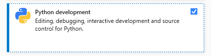
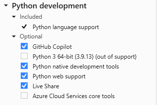
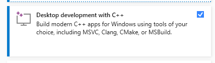
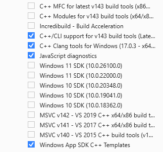

# Development Enviroment

## Procedure to Setup the Development Enviroment

1. Install Python compatible with your AVEVA Module.
    
    For Current Implimentation E3D Module is x86 application. So, Python 3.10.4 32-Bit is installed in the system. If you are using multiple modules having different comptible platform architecture, Please set the paths accordingly while starting the application to call the python module from correct path.

2. In Visual Studio Below mentioned workloads,

    - Python Development Workload with Python Native Development tools, 

        

        

    - Desktop Development using C++ Workload with C++/cli Support For V1XX Build Tools (Latest) and Windows App SDK C++ Templates,

        

        
    
    Other Cpp tools can be installed if required.

3. Open the [PyAVEVAE3D.sln](../PyAVEVAE3D/PyAVEVAE3D.sln) and Add AVEVA dlls references from the AVEVA installation directory for all the projects.

4. Update Paths for C files and libraries to embaded python in the projects as per your environment.

    - Select PyAVEVAE3DExt Project > Right Click > VC++ Directories > 
    
        Include Directories > Add ```Path to Python Installation Directory/include ``` 

        Library Directories > Add ```Path to Python Installation Directory/libs ``` 

    Similarly add the paths for other project e.g. PyAVEVAInteraction.

5. Make Sure the platform is configured as AVEVA & Python compatible architecture ( e.g. Win32 or x64 ) for builds.

6. If you are planning to use TCL/TK, The following paths are required to be added into the enviroment.

    - ```set TCL_LIBRARY=C:\Program Files (x86)\Python310-32\tcl\tcl8.6```
    - ```set TK_LIBRARY=C:\Program Files (x86)\Python310-32\tcl\tk8.6```